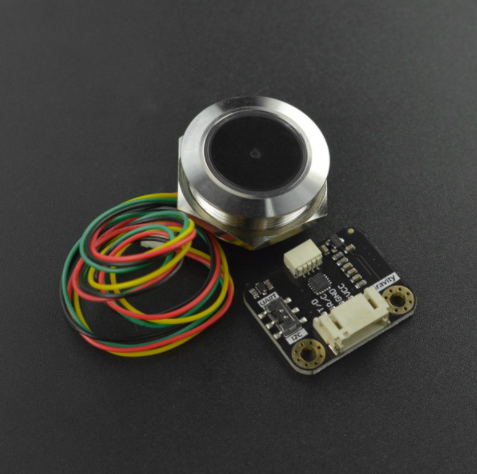

# DFRobot_GM60
- [中文版](./README_CN.md)

GM60 is a highly integrated QR code scanner with excellent performance and a small size.<br>
It can recognize different formats of bar and QR codes such as QR Code, Data Matrix, PDF417, EAN13, UPC, Code 39, Code 93, Code 128, UCC/EAN 128.<br>



## Product Link（https://www.dfrobot.com/product-2485.html)    
   SEN0486：Gravity: Ring 2D QR Code Scanner
## Table of Contents

* [Summary](#summary)
* [Installation](#installation)
* [Methods](#methods)
* [Compatibility](#compatibility)
* [History](#history)
* [Credits](#credits)

## Summary

Provide an Arduino library to get Humidity and Temperature by reading data from dht20.

## Installation

To use this library, first download the library file, paste it into the \Arduino\libraries directory, then open the examples folder and run the demo in the folder.

## Methods
```C++

  /**
   * @fn DFRobot_GM60
   * @brief Constructor 
   */
  DFRobot_GM60();
  
  /**
   * @fn begin
   * @brief Init chip
   * @return Boolean type, Indicates the initialization result
   * @retval true The setting succeeded
   * @retval false Setting failed
   */
  bool begin();
  
  /**
   * @fn encode
   * @brief Read the data encoding mode
   * @param encode Encoding mode
                   eGBK,  //gbk encoding
                   eUTF8, //utf8 encoding
   * @return Boolean type, the result of seted
   * @retval true The setting succeeded
   * @retval false Setting failed
  */
  bool encode(eEncode_t encode);
  
  /**
   * @fn setupCode
   * @brief Set code config, the value of chip register can be changed by using the module to scan QR code
   * @param on true (Enable setting code)/false (Disable setting code)
   * @param content true (Output the set code content)/false (Not output the set code content)
   * @return Boolean type, the result of seted
   * @retval true The setting succeeded
   * @retval false Setting failed
  */
  bool setupCode(bool on,bool content);
  
  /**
   * @fn setIdentify
   * @brief Set the available types of QR code for recognition
   * @param berCode 
            eForbidAllBarcode, //Forbid all the QR code recognition
            eEnableAllBarcode, // Enable all the QR code recognition
            eEnableDefaultcode, // Enable the default QR code recognition
   * @return Boolean type, the result of seted
   * @retval true The setting succeeded
   * @retval false Setting failed
  */
  bool setIdentify(eBarCode_t berCode);
  
  /**
   * @fn reset
   * @brief Restore to factory settings
   * @return Boolean type, the result of seted
   * @retval true The setting succeeded
   * @retval false Setting failed
  */
  bool reset();
  
   /**
   * @fn detection
   * @brief Detect the data contained in the scanned QR code
   * @return  return the scanned data as a character string
   */
  String detection();
```

## Compatibility

MCU                | Work Well    | Work Wrong   | Untested    | Remarks
------------------ | :----------: | :----------: | :---------: | -----
Arduino Uno        |      √       |              |             | 
FireBeetle-ESP8266        |      √       |              |             | 
FireBeetle-ESP32        |      √       |              |             | 
Arduino MEGA2560        |      √       |              |             | 
Arduino Leonardo|      √       |              |             | 
Micro:bit        |      √       |              |             | 
FireBeetle-M0        |      √       |              |             | 
Raspberry Pi      |      √       |              |             | 


## History

- 2020/07/02 - Version 1.0.0 released.
## Credits

Written by fengli(li.feng@dfrobot.com), 2021.7.2 (Welcome to our [website](https://www.dfrobot.com/))


