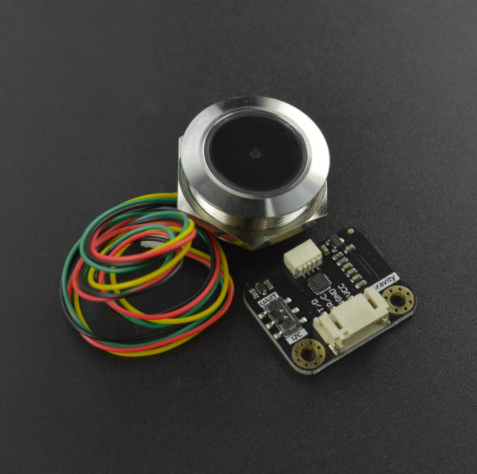

# DFRobot_GM60

GM60 是一款高集成、性能优良的二维码扫描器；外形小巧；可以识别的条码和二维<br>
码格式有 QR Code, Data Matrix, PDF417,EAN13,UPC,Code 39,Code 93,Code<br>
 128,UCC/EAN 128 等<br>




## 产品链接（https://www.dfrobot.com.cn/goods-3398.html)
    SEN0486：Gravity：环形二维码扫描识别传感器
## Table of Contents

* [Summary](#summary)
* [Installation](#installation)
* [Methods](#methods)
* [Compatibility](#compatibility)
* [History](#history)
* [Credits](#credits)

## Summary

Provide a RaspberryPi library for GM60.

## Installation

Download the DFRobot_GM60 file to the Raspberry Pi file directory, then run the following command line to use this sensor:

## Methods
```python
  
  def begin(self):
  '''
    @fn begin
    @brief Init chip
  '''
  
  def reset(self):
  '''
    @fn reset
    @brief Restore factory settings
    @return true (The setting succeeds)/false (The setting failed)
  '''  
      
  def setup_code(self,on,content):
  '''
    @fn setup_code
    @brief Set code config, the value of chip register can be changed by using the module to scan QR code
    @param on true (Enable setting code)/false (Disable setting code)
    @param content true (Output the set code content)/false (The set code content is not output)
    @return true (The setting succeeds)/false (The setting failed)
  '''

  def encode(self,encode):
  '''
    @fn encode
    @brief Read the data encoding scheme
    @param encode Encoding scheme
                    eGBK,
                    eUTF8,
    @return true (The setting succeeds)/false (The setting failed)
  '''

  def set_head_data(self,head):
  '''
    @fn set_head_data
    @brief Add the packet header data into the output data
    @param head The concrete data of packet header e3(0x03)/e4(0x04)
    @return true (The setting succeeds)/false (The setting failed)
  '''

  def set_identify(self,berCode):
  '''
    @fn set_identify
    @brief Set the available types of QR code for recognition
    @param berCode 
           eForbidAllBarcode, //Forbid all the QR code recognition
           eEnableAllBarcode, // Enable all the QR code recognition
           eEnableDefaultcode, // Enable the default QR code recognition
    @return true (The setting succeeds)/false (The setting failed)
  '''
      
  def response_payload(self):
  '''
    @fn response_payload
    @brief Detect the data contained in the scanned QR code
    @return  Return the scanned data as a character string
  '''
```

## Compatibility

| MCU         | Work Well | Work Wrong  | Untested | Remarks |
| ------------ | :--: | :----: | :----: | :--: |
| RaspberryPi2 |      |        |   √    |      |
| RaspberryPi3 |      |        |   √    |      |
| RaspberryPi4 |  √   |        |        |      |

* Python version 

| Python  | Work Well | Work Wrong | Untested | Remarks |
| ------- | :--: | :----: | :----: | ---- |
| Python2 |  √   |        |        |      |
| Python3 |  √   |        |        |      |
## History 

- 2021/07/02 - Version 1.0.0 released.

## Credits

Written by fengli(li.feng@dfrobot.com), 2021.7.2 (Welcome to our [website](https://www.dfrobot.com/))


